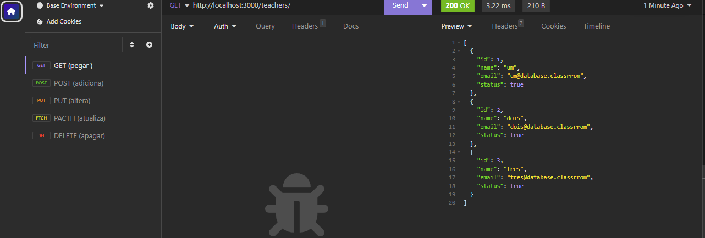
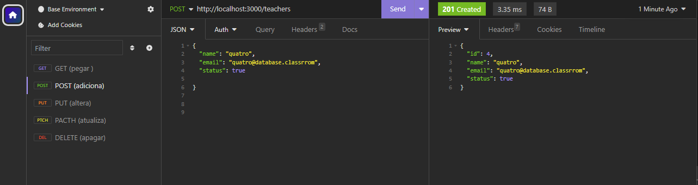
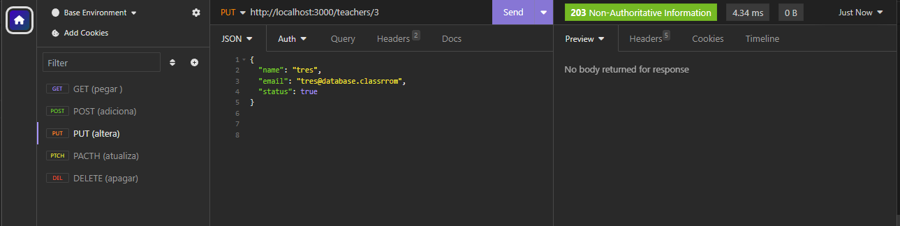
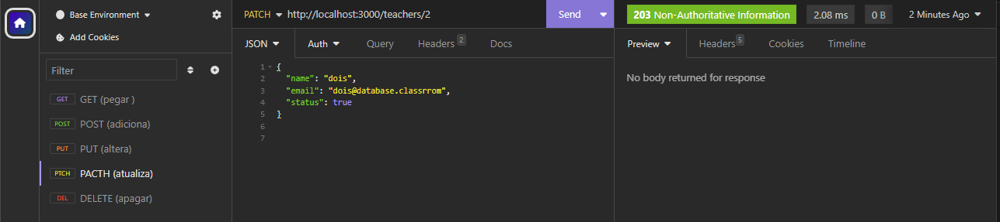
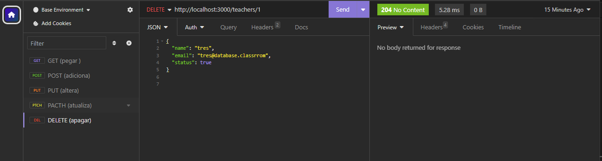

# CRUD-de-listagem-de-professores

Com esse repositório, espero que possa conhecer mais do meu trabalho.

## Projeto CRUD de Listagem de Professores

## Descrição do Projeto
Este projeto é um aplicativo web que permite realizar operações CRUD (Create, Read, Update, Delete) em uma lista de professores. Ele é útil para gerenciar informações sobre professores, incluindo adicionar novos professores, visualizar detalhes, atualizar informações existentes e remover professores da lista.

## Como Executar o Projeto

### Pré-requisitos
Antes de começar, você precisa ter os seguintes pré-requisitos instalados em sua máquina:

- Node.js: [Download](https://nodejs.org/)
- Git: [Download](https://git-scm.com/)

### Passos para Executar o Projeto

1. Clone o repositório para sua máquina usando o Git:
   ```bash
   git clone https://github.com/ThalesFelipe-Dev/CRUD-de-listagem-de-professores

2. Navegue até a pasta do projeto:
   ```bash
   cd CRUD-de-listagem-de-professores


3. Instale as dependências do projeto usando o npm (Node Package Manager):
   ```bash
   npm install


4. Inicie o servidor local:
   ```bash
   npm start

5. Abra o isominia e acesse http://localhost:3000 para usar o aplicativo.

## Prints do Projeto

Aqui estão alguns exemplos de telas do projeto:

### Página Principal


### Adicionar Professor


### Editar Professor


### Detalhes do Professor


### Remover Professor



